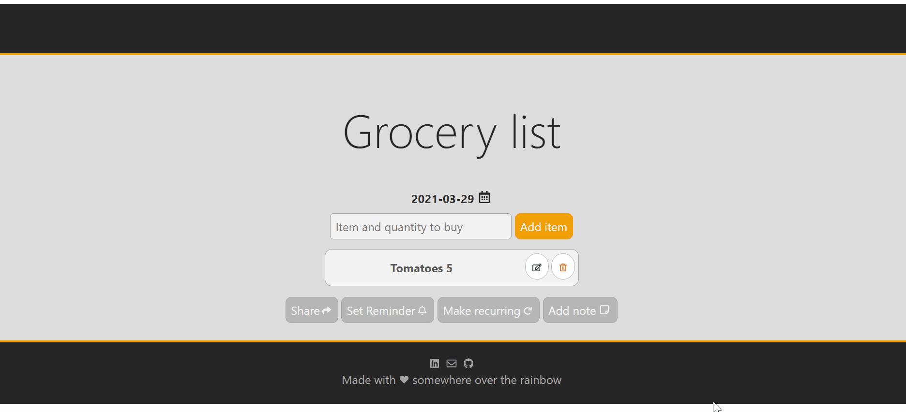

##  :memo: Description
The goal of this project is to learn the Svelte framework by building a responsive grocery list app.
All the data generated from the app are stored in Firebase firestore.
<p align="center">
  
</p>

## :running: Get started

To install and work on Svelte locally:

```
git clone https://github.com/ClaraChaouat/Building-a-grocery-app-with-svelte.git
npm install
```
To watch for changes and continually rebuild the package (this is useful if you're using npm link to test out changes in a project locally):
```
npm run dev
```
Navigate to localhost:5000. You should see your app running. Edit a component file in src, save it, and reload the page to see your changes.

By default, the server will only respond to requests from localhost. To allow connections from other computers, edit the sirv commands in package.json to include the option --host 0.0.0.0.

If you're using Visual Studio Code we recommend installing the official extension Svelte for VS Code. If you are using other editors you may need to install a plugin in order to get syntax highlighting and intellisense.

## :construction_worker: Building and running in production mode
To create an optimised version of the app:

```
npm run build
```
You can run the newly built app with npm run start. This uses sirv, which is included in your package.json's dependencies so that the app will work when you deploy to platforms like Heroku.

## :iphone: Single-app app mode

By default, sirv will only respond to requests that match files in public. This is to maximise compatibility with static fileservers, allowing you to deploy your app anywhere.

If you're building a single-page app (SPA) with multiple routes, sirv needs to be able to respond to requests for any path. You can make it so by editing the "start" command in package.json:
```
"start": "sirv public --single"
```
## :computer: Technologies 
Technologies used to build the app:

- Svelte,
- Firebase,
- Javascript,
- html,
- css

## :dancer: Demo
Willing to play with the web app version? Click on the link below :point_down: :

https://groceryapp-with-svelte.netlify.app/

## :notebook_with_decorative_cover: Major learnings
- Svelte framework,
- Firebase firestore,
- Responsive design,
- Specific attention to accessibility.

## :see_no_evil::hear_no_evil::speak_no_evil: Feedback
I'm still in a learning process of web development so feel free to shoot me an e-mail If you have any feedbacks/comments or any usefull things that could help me to keep improving :relaxed:.

:email: clara.chaouat@gmail.com

